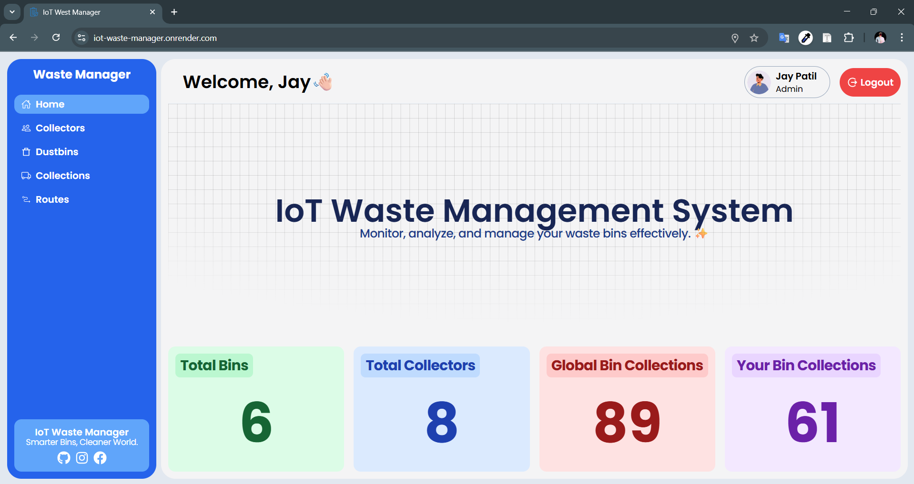
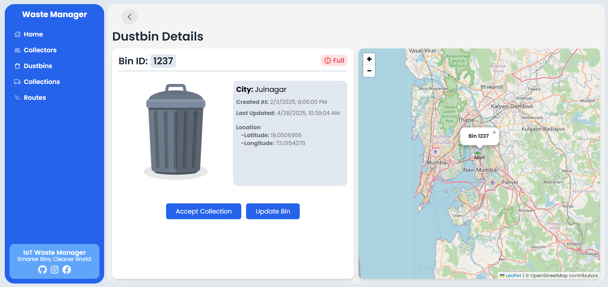
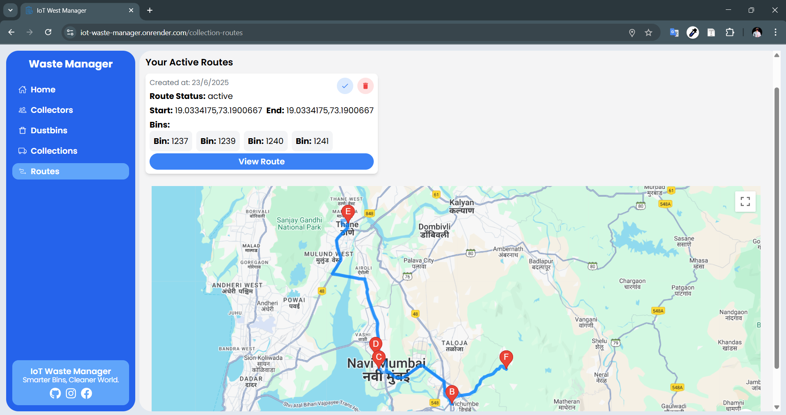

# 🗑️ IoT Smart Waste Manager

An IoT-based smart waste management system that monitors garbage bin levels in real-time, displays them on a map, and alerts when bins are full. The project aims to optimize waste collection processes in urban areas using low-cost sensors and real-time data. With help of optimized routes collector can save time as well as fuel of collection vehicle.

## 🌐 Live Demo

🔒 The website is login-protected. Use the test credentials below to explore the system:

**Demo Login**  
🔑 Email: `guest@gmail.com`  
🔐 Password: `guest1234`

👉 [Live Website](https://iot-waste-manager.onrender.com)


## 📌 Project Description

This project solves the problem of inefficient garbage collection by integrating hardware (sensors + microcontroller) with a web-based dashboard. Smart bins automatically detect their fill level and send data to a central system, which visualizes the status of each bin on a map interface.

## 🚀 Features

- 📡 **Real-Time Bin Monitoring** using ultrasonic sensors
- 🗺️ **Map Integration** showing bin locations and status (Full/Not Full)
- 🔔 **Full Bin Alerts** to notify when collection is required
- 🛣️ **Optimized Collection Routes** – Suggests efficient paths for garbage collectors to save time and fuel.
- 📊 **Dashboard Interface** for viewing and managing bins
- 🔌 **Wireless Data Transmission** (via Wi-Fi or GSM)
- 🧠 **Modular Architecture** with hardware and software separation

## 🛠️ Technologies Used

### 💡 Hardware:
- ESP32 Microcontroller Wi-Fi Module
- Ultrasonic Sensor (HC-SR04)
- Neo-6M GPS Module
- Connecting Wires
- Power Supply

### 🧑‍💻 Software:
- Embedded C/C++ (Arduino IDE)
- Next.js + Tailwind CSS (Dashboard)
- MongoDB (Database)
- Google Maps API and Leaflet.js (for bin location display)


## 📁 Project Structure

```
IOT-WASTE-MANAGER/
├── app/                         # Main application folder
│   ├── protectedRoutes/        # Protected pages/routes
│   │   ├── collection-routes/
│   │   ├── collections/
│   │   ├── collectors/
│   │   └── dustbins/
│   ├── api/                    # API route handlers
│   ├── components/             # Reusable frontend components
│   ├── login/                  # Login/authentication UI
│   │   ├── layout.js           # Layout structure for app
│   │   ├── page.js             # Entry Page - Login
│   ├── globals.css             # Global styles
│   └── favicon.ico             # Site icon
├── diagrams/                   # Diagrams about project structure
│   └── system-flow.jpg
├── hardware/                   # Arduino hardware code
│   └── hardware-sketch.ino
├── lib/                        # Utility functions
├── models/                     # Mongoose/MongoDB schema files
│   ├── bin.js
│   ├── binCollection.js
│   ├── binCollectionActivity.js
│   ├── collectionRoute.js
│   └── collector.js
├── node_modules/               # Node.js dependencies
├── public/                     # Static files served to client
│   ├── images/                 # Project images (icons, bins, etc.)
│   └── screenshots/            # Screenshots used in README.md
├── server.js                   # Custom server for real-time Socket.IO
├── render.yaml                 # Render deployment configuration
├── .gitignore                  # Ignored files and folders
└── README.md                   # Project documentation
```


## 🧪 How It Works

1. **Sensors** in bins detect garbage level.
2. **Microcontroller** processes sensor data.
3. If bin is near full, it sends data to server.
4. Web dashboard displays all bins with **color-coded markers**:
   - 🟢 Empty / Normal
   - 🔴 Full
5. Authorities get notified and can dispatch collection vehicles.
6. Based on full bins system generates most efficient route.

## 🎯 Goals Achieved

- Reduced manual checking of bins
- Improved garbage collection route efficiency
- Promoted use of low-cost IoT in public services

## 📷 Screenshots

### 🔧 Dashboard View


### 🗺️ Bin Status with Map View


### 🛣️ Optimized Route Generation Page



## 🏆 Awards / Recognition

- 🥇 Presented as final year project
- 🏆 Won 1st Prize at **INNOTRON** – State Level Business Idea Presentation Event  
- 🏅 Selected for final showcase at **CIIA-4 Project Exhibition**, where only 100 projects were chosen from 700+ entries
- 🎓 Built with practical implementation goals in mind


## 📜 License

⚠️ This project is copyrighted and not open-source.
Please do not copy, reuse, or modify this code without permission.

---

## 🤝 Contributions

If you’d like to suggest improvements or collaborate, feel free to fork or open an issue.

